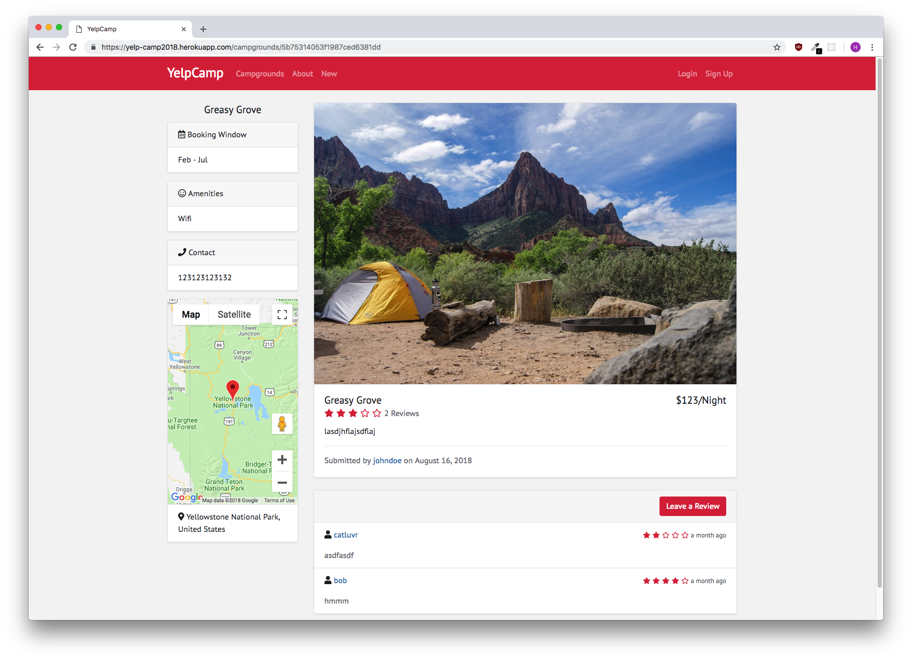

# YelpCampgrounds Project

This is a project that is centered around the implementation and use of the Node.js, Express.js, JavaScript and HTML & CSS to create a web application that allows users to share and review campgrounds.

## Project Features & Functionalities

It is centered around a web based application that contains multiple pages such as:

- Splash Screen page
- Login & Authentication Pages
- Main Page with all the campgrounds & a cluster map showing their locations
- Review Pages
- Adding Campgrounds
- Reviewing Campgrounds

## Steps taken in the implementation of the project & What I learned

1. YelpCamp - Campgrounds CRUD Operations
2. Middleware - Express Implementation
3. MongoDB - Relationships with Express
4. Authentication - Adding in Authentication & Sessions
5. Features & Functionalities - Adding Maps, Image Uploads
6. Styling - Adding in Bootstrap to the YelpCamp Project

## How to run the project

1. Install [mongodb](https://www.mongodb.com/)
2. Create a cloudinary account to get an API key and secret code

```
git clone https://github.com/himanshup/yelpcamp.git
cd yelpcamp
npm install
```

Create a .env file (or just export manually in the terminal) in the root of the project and add the following:  

```
DATABASEURL='<url>'
API_KEY=''<key>
API_SECRET='<secret>'
```

Run ```mongod``` in another terminal and ```node app.js``` in the terminal with the project.  

Then go to [localhost:3000](http://localhost:3000/).

To get google maps working check [this](https://github.com/nax3t/google-maps-api) out.

## Screenshots



