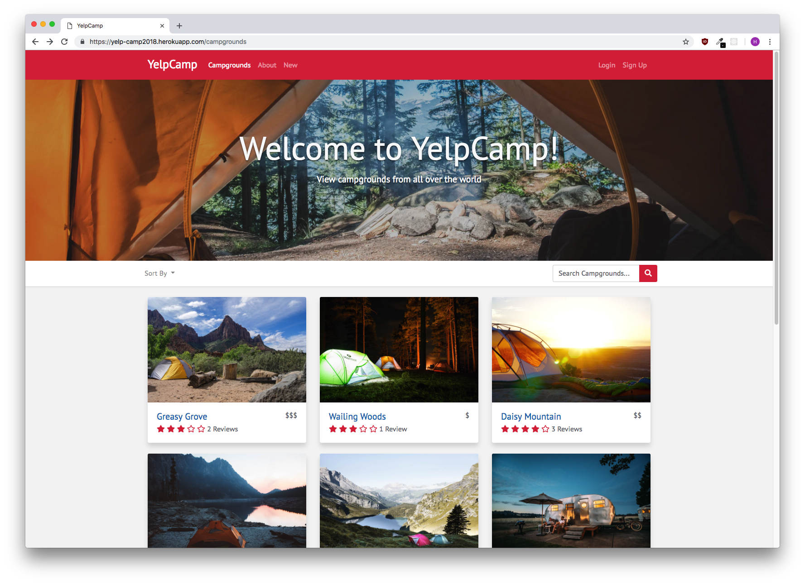

# YelpCampgrounds Project

This is a project that is centered around the implementation and use of the Node.js, Express.js, JavaScript and HTML & CSS to create a web application that allows users to share and review campgrounds.

## Project Features & Functionalities

It is centered around a web based application that contains multiple pages such as:

- Splash Screen page
- Login & Authentication Pages
- Main Page with all the campgrounds & a cluster map showing their locations
- Review Pages
- Adding Campgrounds
- Reviewing Campgrounds

## Steps taken in the implementation of the project & What I learned

1. YelpCamp - Campgrounds CRUD Operations
2. Middleware - Express Implementation
3. MongoDB - Relationships with Express
4. Authentication - Adding in Authentication & Sessions
5. Features & Functionalities - Adding Maps, Image Uploads
6. Styling - Adding in Bootstrap to the YelpCamp Project

## Screenshots

